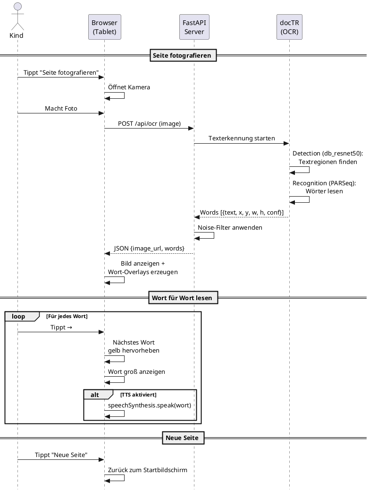

# Focus Read

A reading aid for children: capture a book page, then read word-by-word with highlighting and text-to-speech.

## How it works

1. Take a photo of a book page (or upload an image)
2. OCR detects every word with its position on the page
3. Tap/click to advance through words one at a time
4. Each word is highlighted and optionally spoken aloud

## Prerequisites

- **Python 3.10+**

That's it — no system-level OCR engine needed. The ML models are downloaded automatically on first run.

## Quick start

```bash
make install   # create venv + install dependencies
make run       # start server on http://localhost:8000
```

Open `http://localhost:8000` on your phone/tablet (same network).

## Commands

| Command       | Description                            |
|---------------|----------------------------------------|
| `make install`| Create virtualenv and install deps     |
| `make run`    | Start the server on port 8000          |
| `make test`   | Run OCR on example image (smoke test)  |
| `make clean`  | Remove virtualenv and uploaded files   |

## Tech stack

- **Backend:** FastAPI
- **Frontend:** Vanilla HTML/JS/CSS
- **OCR:** [docTR](https://github.com/mindee/doctr) (PyTorch) with [multilingual PARSeq](https://huggingface.co/Felix92/doctr-torch-parseq-multilingual-v1) recognition model
- **TTS:** Web Speech API (rate 0.8, toggleable)

## Use case



## Architecture Decision Records

- [ADR-001: OCR Engine Selection](docs/adr/001-ocr-engine.md) — why docTR over Tesseract, PaddleOCR, Surya, EasyOCR
- [ADR-002: OCR Post-Processing](docs/adr/002-ocr-postprocessing.md) — why noise filter only, no spell-checker or LLM
- [ADR-003: Application Architecture](docs/adr/003-architektur.md) — why FastAPI + vanilla frontend
