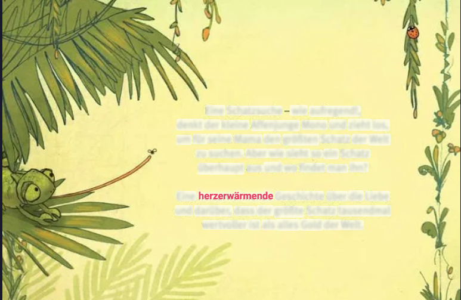
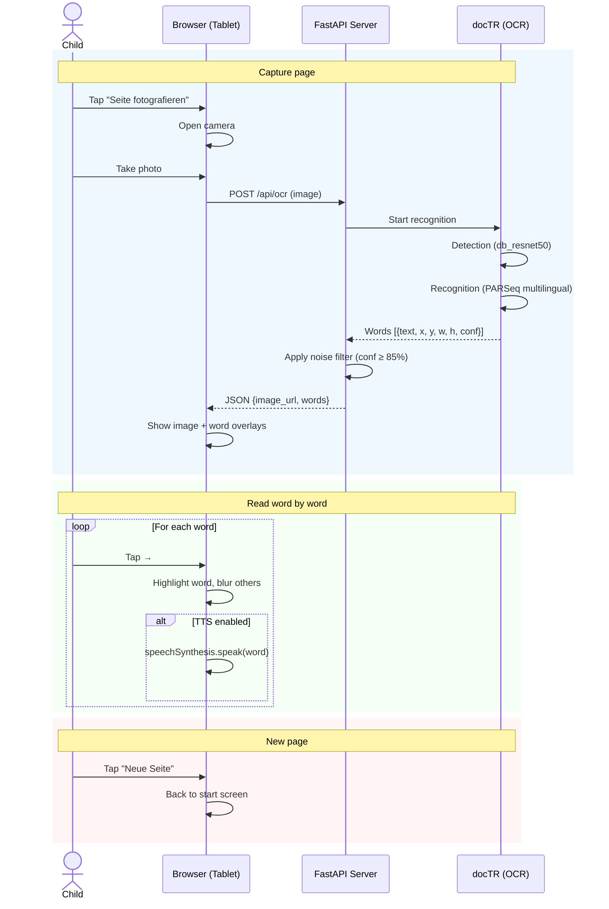

# Focus Read

A reading aid for children: capture a book page, then read word-by-word with highlighting and text-to-speech.

The active word is displayed directly over the original text on the page while surrounding words are softly blurred — keeping the child oriented on the page while focusing attention on one word at a time.



## How it works

1. Take a photo of a book page (or upload an image)
2. OCR detects every word with its bounding box position
3. Tap or click to advance through words one at a time
4. The active word is highlighted on the page and optionally spoken aloud

## Quick start

```bash
make install   # create venv + install dependencies
make run       # start server on http://localhost:8000
```

Open `http://localhost:8000` on your phone or tablet (same network).

### Prerequisites

- **Python 3.10+**

No system-level OCR engine required. ML models are downloaded automatically on first run (~200 MB, cached afterwards).

## Commands

| Command        | Description                           |
|----------------|---------------------------------------|
| `make install` | Create virtualenv and install deps    |
| `make run`     | Start the server on port 8000         |
| `make lint`    | Lint backend code with ruff           |
| `make test`    | Run OCR on example image (smoke test) |
| `make clean`   | Remove virtualenv and uploaded files  |

## Tech stack

| Layer        | Technology                                                                                                                                                     |
|--------------|-------------------------------------------------------------------------------------------------------------------------------------------------------------------|
| **Backend**  | [FastAPI](https://fastapi.tiangolo.com/) — one endpoint, static file serving                                                                                      |
| **Frontend** | Vanilla HTML / JS / CSS — no build step, no framework                                                                                                             |
| **OCR**      | [docTR](https://github.com/mindee/doctr) (PyTorch) with [multilingual PARSeq](https://huggingface.co/Felix92/doctr-torch-parseq-multilingual-v1) recognition model |
| **TTS**      | Web Speech API (rate 0.8, toggleable)                                                                                                                             |

## Architecture



## Project structure

```
focus-read/
├── backend/
│   ├── main.py              # FastAPI app, routes, static files
│   ├── ocr.py               # docTR pipeline + noise filter
│   └── requirements.txt
├── frontend/
│   ├── index.html           # Single page app
│   ├── style.css            # Word highlighting, responsive layout
│   └── app.js               # Camera, OCR API, word navigation, TTS
├── examples/                # Sample book cover images for testing
├── images/                  # Screenshots for documentation
├── docs/adr/                # Architecture Decision Records
└── Makefile
```

## Architecture Decision Records

- [ADR-001: OCR Engine Selection](docs/adr/001-ocr-engine.md) — why docTR over Tesseract, PaddleOCR, Surya, EasyOCR
- [ADR-002: OCR Post-Processing](docs/adr/002-ocr-postprocessing.md) — why noise filter only, no spell-checker or LLM
- [ADR-003: Application Architecture](docs/adr/003-architektur.md) — why FastAPI + vanilla frontend

## License

MIT
