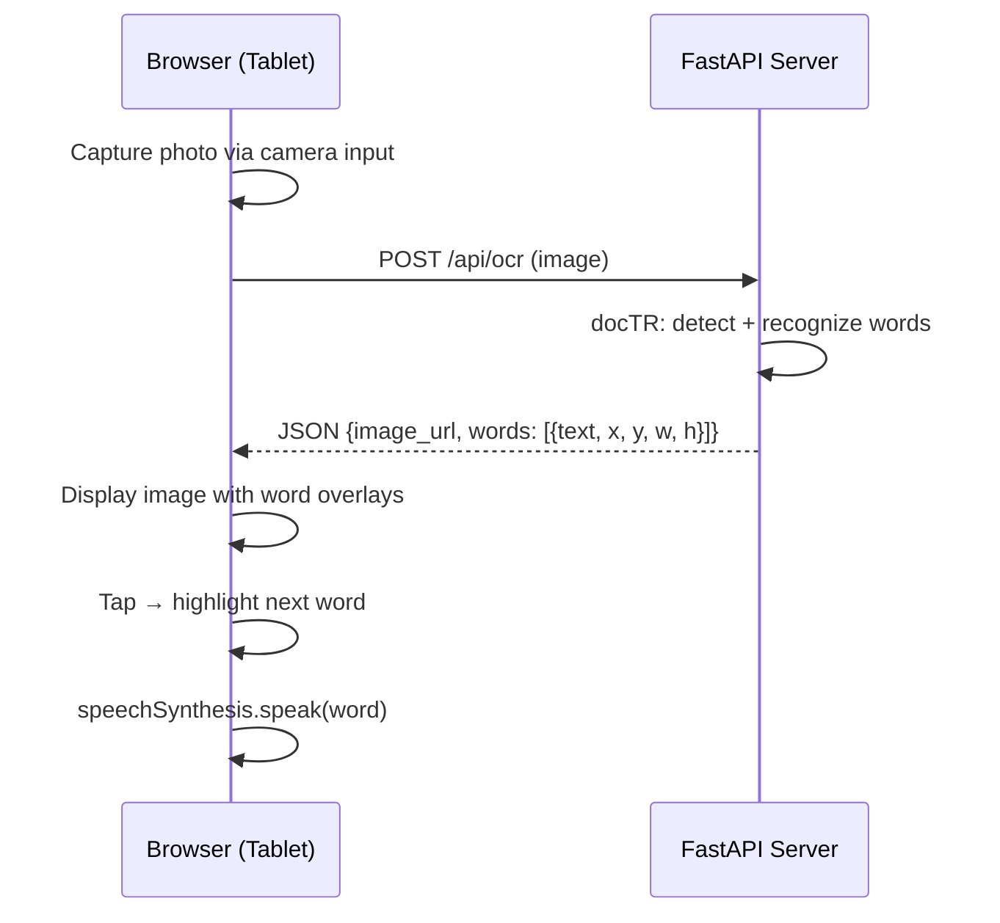

# ADR-003: Application Architecture

## Status
Accepted

## Context
The app is intended for use by children on tablets/phones: photograph a book page, highlight words one at a time, read aloud.

## Considered Options

### Native app (iOS/Android)
- Best camera integration and performance
- Two codebases or React Native/Flutter
- App store deployment required
- Overkill for this use case

### Electron/Desktop app
- No camera access on tablets
- Not suitable for this use case

### Python backend + web frontend ✅ Chosen
- **Backend:** FastAPI — minimal HTTP server, static files, one OCR endpoint
- **Frontend:** Vanilla HTML/JS/CSS — no build step, no framework
- **Camera:** `<input type="file" capture="environment">` — uses the device's native camera app
- **TTS:** Web Speech API (`speechSynthesis`) — built into the browser, no dependency

## Decision
**FastAPI + vanilla frontend.** Minimal architecture:

## Consequences
- A single `make run` starts everything
- Works on any device on the same network
- No build step, no npm, no bundler
- OCR runs on the server (CPU-intensive) — not on the tablet
- TTS runs in the browser — no server dependency for audio
